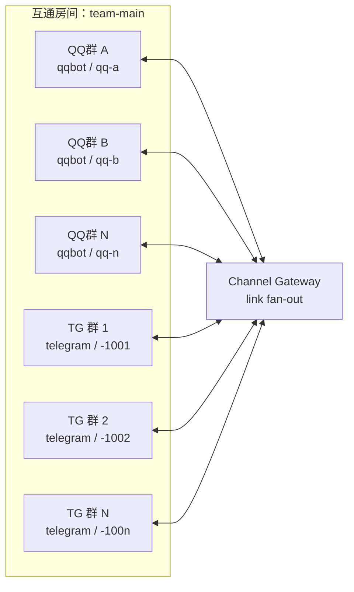
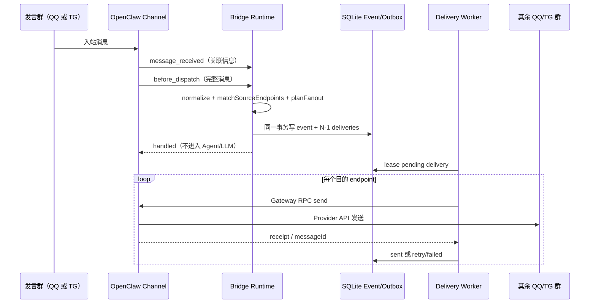
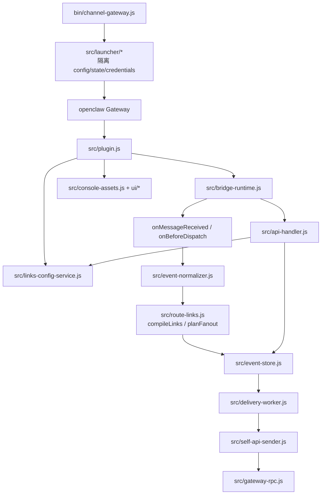
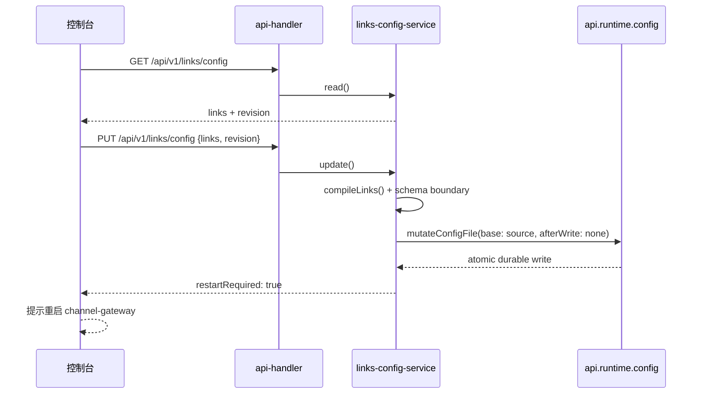

# Channel Gateway：拓扑、交互、框架与调用逻辑图

> 图中一个 **link（互通房间）** 可包含 N 个 endpoint。endpoint 是一个实际 QQ/TG 群（`channel + accountId + conversationId + to`）。因此无需为 QQ↔TG 单独写规则：任一 endpoint 入站后 fan-out 到同 link 的其他可发送 endpoint。

## 1. 拓扑图：1↔N 与 N↔N



**规则：** 任一个群发消息，Gateway 向该房间其它 `send:true` endpoint 投递；发送群自身不会收到回环。删去任意 endpoint 即不再参与该房间。

## 2. 交互图：一条消息如何转发



## 3. 框架图：运行组件和信任边界

```mermaid
flowchart TB
  Browser[浏览器控制台\n/channel-gateway\nToken 仅内存] -->|Bearer| Api[/api/v1/*\nGateway auth]
  Browser -. 静态 HTML/CSS/JS .-> Static[plugin-managed 静态资产]
  Api --> ConfigSvc[Links Config Service]
  ConfigSvc -->|mutateConfigFile base=source| HostCfg[OpenClaw Host Config Writer\nJSON5 / lock / backup / atomic write]
  Api --> Runtime[Bridge Runtime]
  Runtime --> SQLite[(SQLite\nevents + deliveries)]
  Runtime --> Rpc[Gateway RPC]
  Worker[Delivery Worker] --> SQLite
  Worker --> Rpc
  Rpc --> Channels[Telegram / QQBot / 其它 Channel]
  Channels --> Groups[各群 endpoint]
```

静态控制台不携带配置或凭据；可写 API 必须经过 Gateway Bearer token。控制台只写 `plugins.entries.channel-gateway.config.links`，不会写平台 token、AppSecret、session 或 OAuth/二维码凭据。

## 4. 代码调用逻辑图



## 管理页保存流程


