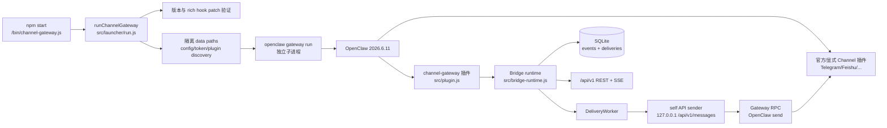
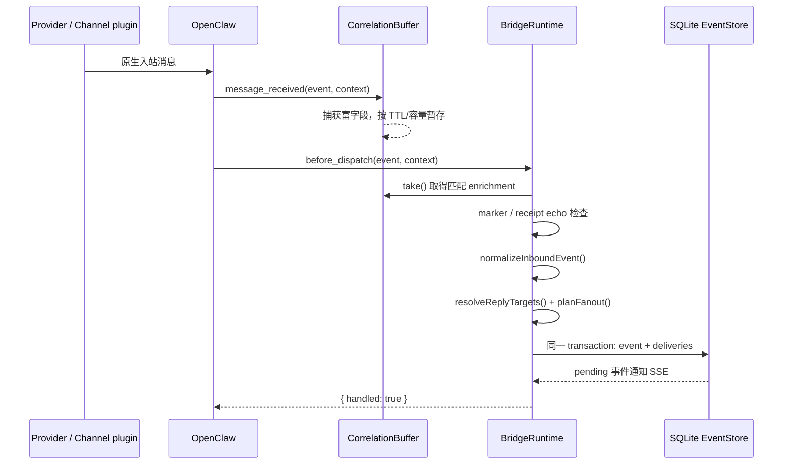
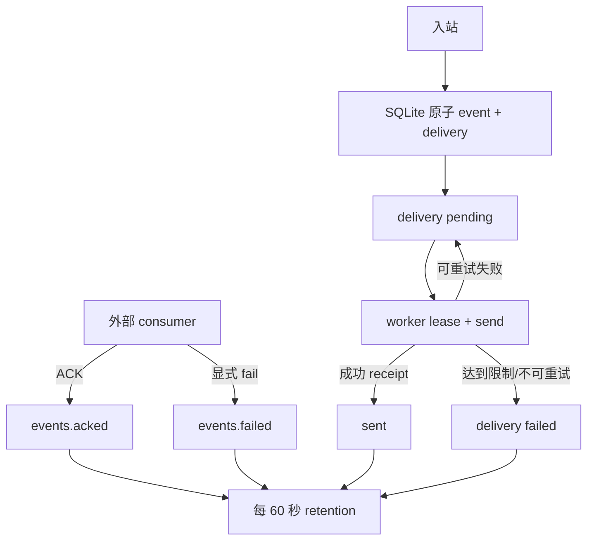

# Channel Gateway 调用结构与使用说明

本文说明当前仓库真实代码的运行链路、持久化边界和最小操作方式。它是
[`README.md`](./README.md) 与 [`操作手册.md`](./操作手册.md) 的结构索引：前者是完整部署/平台接入
说明，后者是值班操作手册；本文不替代其中的平台凭据、群准入或备份要求。

> **边界**：Channel Gateway 固定运行 `openclaw@2026.6.11`。它复用 OpenClaw 及其官方 Channel
> 插件作为 connector kernel，不复制 QQ、飞书、WhatsApp、Telegram 等 provider 协议实现。Bridge
> 在入站 `before_dispatch` 阶段截获消息并返回 `{ handled: true }`，因此已被 Bridge 接收的消息不会进入
> Agent/LLM。

## 1. 进程、入口与模块边界



### 1.1 启动链

| 顺序 | 真实入口/模块 | 职责 |
| --- | --- | --- |
| 1 | `bin/channel-gateway.js` | `npm start` 的 CLI 入口，调用 `runChannelGateway({ serviceRoot })`；仅输出首行错误并设置非零退出码。 |
| 2 | `src/launcher/run.js` | 校验 Node、固定 OpenClaw 版本和 rich `before_dispatch` patch；准备隔离目录，发现 Channel 包，生成或验证配置与 token。 |
| 3 | `src/launcher/{paths,config,token,process}.js` | 将 `config/`、`state/`、`credentials/`、`workspace/` 隔离在 `CHANNEL_GATEWAY_DATA_DIR`；创建私有 token；以子进程启动 `openclaw gateway run`，只转发第一个 `SIGINT`/`SIGTERM`。 |
| 4 | `index.js` → `src/plugin.js` | OpenClaw 加载 Bridge 插件，注册 `message_received`、`before_dispatch`、`/api/v1` 路由和生命周期回调。 |
| 5 | `src/bridge-runtime.js` | 创建 EventStore、correlation buffer、SSE hub、Gateway RPC facade 和（存在 links 时）delivery worker。 |

launcher 不会静默覆盖已有配置：已有 `config/openclaw.json` 必须继续满足隔离数据库/workspace、token auth、Bridge/load path、禁用 Control UI/reload、Channel 载入与端口等约束，否则拒绝启动。

### 1.2 启动时的关键不变量

- Node：`>=22.22.2 <23`（运行时 launcher 最低兼容检查为 22.19.0；项目锁定依赖要求更高版本）。
- Host：仅 `openclaw@2026.6.11`；启动前验证 rich hook marker，未打补丁不启动。
- token：`OPENCLAW_GATEWAY_TOKEN` 用于 OpenClaw 和 `/api/v1`。未提供时 launcher 生成凭据目录中的私有 token；生产应由 secret manager 注入。
- links 非空时必须有 token，因为 worker 通过本机受认证的 API 回送消息。
- Bridge 只在 OpenClaw `registrationMode === "full"` 时注册；`gateway_start` 后才启动 worker/定时保留清理。

## 2. 入站消息：从 provider 到 durable event



1. **富字段采集**：`message_received` 先调用 `CorrelationBuffer.capture()`。固定 Host 的 rich hook patch 让
   `before_dispatch` 可以保留/传递 `messageId`、thread、sender name/username、metadata、媒体路径/URL/type
   以及远程媒体 staging 结果。correlation 使用精确 message identity、session 或 conversation+timestamp+正文哈希
   等键，在默认 30 秒、最多 10,000 条窗口内匹配两次 hook。
2. **拦截与标准化**：`before_dispatch` 使用 `take()` 合并 enrichment，再由
   `normalizeInboundEvent()` 得到 canonical event。其稳定 id 优先基于
   `channel/accountId/conversationId/messageId`；缺少 `messageId` 时才使用 sender、时间与正文哈希。
3. **防环/去重**：Bridge 先识别末尾不可见 marker（`cg1`）与已投递 receipt；随后用目标
   `channel/account/conversation/messageId` 查询 delivery receipt。命中即直接 `{ handled: true }`，不重新 fan-out。
4. **原子落库**：`EventStore.enqueue()` 在一个 SQLite transaction 中写入 `events` 和首次生成的 `deliveries`。
   同 id 的后续 richer event 只补充空字段，**不会重新创建 deliveries**。SQLite commit 失败时仍返回
   `{ handled: true }`，health 变为 degraded（fail-closed，避免消息转入 LLM）。
5. **规划路由**：`compileLinks()` 对 endpoint 建索引；`planFanout()` 只让匹配的 source endpoint 投递到同一
   link 内其他 `send:true` endpoint。每个 delivery id 由 `eventId/linkId/destinationEndpointId` 稳定派生，
   并同时用作 `idempotencyKey`。

### 2.1 canonical event 与持久化对象

这些是实现中的关键字段摘要，不是 provider 原始 payload 的完整镜像：

| 对象 | 关键字段 | 用途 |
| --- | --- | --- |
| canonical event | `id`, `channel`, `accountId`, `conversationId`, `messageId`, `sender`, `text`, `threadId`, `replyTo`, `media`, `metadata`, `receivedAt` | `/events` 与 SSE 的 durable input；保留跨 Channel 路由、关联和审计所需内容。 |
| `events` 表 | payload JSON、`pending/acked/failed`、创建/更新/ACK/失败时间 | 给外部消费者读取和 ACK 的事件队列。 |
| delivery | `id`, `eventId`, `linkId`、源/目标 endpoint、发送 request、状态、attempts、lease、receipt、error code | durable outbox；状态为 `pending/sending/sent/failed`。 |
| link endpoint | `id`, `channel`, `accountId`（默认 `default`）、`conversationId`, `to`, `receive`, `send`, `threadId` | `conversationId` 用于入站匹配；`to` 传给 OpenClaw `send`，二者必须分别按真实 provider 状态核验。 |

## 3. 自动 fan-out：durable outbox 到 provider

```text
SQLite pending delivery
  -> DeliveryWorker.claimNextDelivery(lease)
  -> self-api-sender POST http://127.0.0.1:<port>/api/v1/messages
  -> api-handler
  -> GatewayRpc.send(expectFinal: true, timeout: 30s)
  -> OpenClaw channel send
  -> receipt messageId
  -> EventStore.completeDelivery(sent + receipt)

失败：retryDelivery -> pending（退避/Retry-After/至少约 301 秒 gateway failure cache）
超过 maxAttempts 或不可重试：failed
```

- `DeliveryWorker` 由 `gateway_start` 启动；每次 lease 一个 due delivery，默认最多 100 个/轮、5 次尝试、60 秒 lease。
- worker 不直接调用 provider，而是调用本进程 loopback REST endpoint；因此 operator auth、请求校验、RPC deadline 和
  发送语义只有一条实现路径。
- `GatewayRpc` 只允许经过白名单校验的 `channels.status/start/stop/logout` 与 `send` 参数，并使用
  `expectFinal: true`、30 秒 deadline。超时/未知结果不会伪装成发送成功。
- provider 返回 `messageId` 时保存 receipt，后续来自该目标的 reply 可通过 `resolveReplyTargets()` 映射回相关
  端点；无法取得 receipt 的 provider 路径只能按 at-least-once 投递理解。
- marker + receipt + scoped message identity 共同避免回声。不要人工附加或伪造 marker。

## 4. 控制面：REST、SSE 与 ACK

`/healthz` 是 OpenClaw 的无认证存活检查；其余 API 是 Bridge trusted-operator surface，均要求 Bearer token。
将 token 用 curl config 的 stdin 传递，避免将 token 放到命令行参数或 `ps` 输出中：

```bash
BASE=http://127.0.0.1:18789
cgcurl() {
  curl --config - "$@" <<EOF_CURL
header = "Authorization: Bearer ${CHANNEL_GATEWAY_TOKEN}"
EOF_CURL
}

curl "$BASE/healthz"
cgcurl "$BASE/api/v1/health"
cgcurl "$BASE/api/v1/channels?probe=true"
cgcurl "$BASE/api/v1/links"
cgcurl "$BASE/api/v1/events?limit=100"
```

| 接口 | 方法 | 实际调用/语义 |
| --- | --- | --- |
| `/api/v1/health` | GET | Bridge health、版本、DB 状态、pending event 与四类 delivery count；degraded 时 503。 |
| `/api/v1/channels?probe=true|false` | GET | `GatewayRpc.status()` → `channels.status`。 |
| `/api/v1/links` | GET | 已编译 link 的安全摘要和 delivery counts；不回显 endpoint `to`。 |
| `/api/v1/messages` | POST | `GatewayRpc.send()` → OpenClaw `send`；请求需 `channel`、`to`、`idempotencyKey`，`message` 可选。 |
| `/api/v1/channels/:channel/{start,stop,logout}` | POST | 对应 Gateway lifecycle RPC；body 仅允许可选 `accountId`。 |
| `/api/v1/events?after=<eventId>&limit=1..500` | GET | 读取仍为 `pending` 的 canonical events；未知 cursor 为 400。 |
| `/api/v1/events/:eventId/ack` | POST | 将 pending event 变为 acked；重复 ACK 在 tombstone TTL 内幂等。 |
| `/api/v1/events/stream` | GET | SSE：先 replay 全部 pending event，再推实时事件与 heartbeat。 |

受控发送、ACK 和 SSE 示例：

```bash
# 同一逻辑发送重试时复用同一个 idempotencyKey。
cgcurl -X POST -H 'Content-Type: application/json' \
  -d '{"channel":"telegram","accountId":"default","to":"-1001234567890","message":"hello","mediaUrls":[],"idempotencyKey":"operator-20260711-1"}' \
  "$BASE/api/v1/messages"

# 只有在自己的消费者已 durable commit 后 ACK。
cgcurl -X POST -H 'Content-Type: application/json' -d '{}' \
  "$BASE/api/v1/events/evt_123/ack"

# Last-Event-ID 仅是观察水位，服务仍 replay 全部 pending。
cgcurl -N -H 'Last-Event-ID: evt_122' "$BASE/api/v1/events/stream"
```

SSE 连接先订阅再读 SQLite snapshot，以 seen set 避免 replay 期间重复；慢消费者超过有界队列会被断开，客户端应
重连并依赖 pending replay 恢复，而不是把 SSE 当成唯一消息存储。

## 5. 重启、失败与保留



- 进程重启后 SQLite 中的 `pending` 或过期 lease 的 `sending` delivery 可被重新 claim；这是 durable outbox 的恢复边界。
- delivery 先清理已 `sent/failed` 且父 event 已过 ACK/failed TTL 的 relation，再删除没有 delivery relation 的
  acked/failed event tombstone。默认 ACK TTL 为 5 分钟，failed TTL 为 24 小时；Bridge 每 60 秒调用 `prune()`。
- 未 ACK 的 event 不进入这项 tombstone 清理；外部消费者必须自行可靠处理和 ACK。
- API/SQLite 故障会让 health degraded；应修复磁盘、权限或配置后重启，不能绕过 durable store。发送失败有可控
  错误码及 retry 语义，具体 provider 是否最终收到了消息仍须按其 receipt/平台行为验证。

## 6. 最小本地使用流程

以下只启动 kernel 与 Bridge；真实 provider 收发还要完成原生 onboarding、平台网络权限和真实凭据。

```bash
cd /Users/sanbo/Desktop/openclaw/channel-gateway

# 只用 core/Telegram 能力；需 Discord/Feishu/Slack/WhatsApp 改为 --include=optional。
npm ci --omit=dev --omit=optional
npm run verify:openclaw-patch

export CHANNEL_GATEWAY_DATA_DIR="$PWD/.channel-gateway"
export CHANNEL_GATEWAY_TOKEN="$(openssl rand -hex 32)"
export CHANNEL_GATEWAY_BIND=loopback
npm start
```

首次启动会创建私有数据目录。停止服务后，用**同一数据目录**执行 OpenClaw 原生 onboarding，再编辑生成的
`$CHANNEL_GATEWAY_DATA_DIR/config/openclaw.json`；已有配置不满足 launcher 的隔离不变量时应修正，而不是删除重建：

```bash
export OPENCLAW_HOME="$CHANNEL_GATEWAY_DATA_DIR"
export OPENCLAW_CONFIG_PATH="$CHANNEL_GATEWAY_DATA_DIR/config/openclaw.json"
export OPENCLAW_STATE_DIR="$CHANNEL_GATEWAY_DATA_DIR/state"
export OPENCLAW_WORKSPACE_DIR="$CHANNEL_GATEWAY_DATA_DIR/workspace"
export OPENCLAW_OAUTH_DIR="$CHANNEL_GATEWAY_DATA_DIR/credentials"
export OPENCLAW_GATEWAY_TOKEN="$CHANNEL_GATEWAY_TOKEN"
export OPENCLAW_GATEWAY_PORT="${CHANNEL_GATEWAY_PORT:-18789}"

./node_modules/.bin/openclaw channels add
./node_modules/.bin/openclaw channels status --probe
```

### 6.1 最小 links 形状

在 `plugins.entries.channel-gateway.config.links` 放入按真实会话 id 替换后的配置。下面是两个 endpoint 的结构示例；
`conversationId` 与 `to` 不能假定相同：

```json5
{
  id: "bridge-a-b",
  endpoints: [
    { id: "telegram-a", channel: "telegram", accountId: "default",
      conversationId: "-1001234567890", to: "-1001234567890" },
    { id: "feishu-b", channel: "feishu", accountId: "default",
      conversationId: "oc_actual_chat_id", to: "oc_actual_chat_id" }
  ]
}
```

每个 endpoint 默认 `receive:true`、`send:true`，所以此 link 是双向的；设置任一字段为 `false` 才形成单向边界。
群普通消息还必须由 provider/OpenClaw 群策略允许，例如精确群配置的
`groups.<conversationId>.requireMention=false` 与群/成员 allowlist。Telegram 要在 BotFather 执行
`/setprivacy` → **Disable**。完整 QQ、飞书、WhatsApp、Telegram 配置和群准入说明见 `README.md`、`操作手册.md`。

## 7. 证据范围与上线验证

| 已由仓库测试/本地 smoke 覆盖的 contract | 仍必须使用真实 provider 凭据验证 |
| --- | --- |
| 事件标准化、correlation、SQLite event/outbox、fan-out、echo suppression、reply relation、worker retry/lease、REST/SSE/ACK、retention，以及 fake 四 endpoint 的重启恢复。 | QQ、飞书、WhatsApp、Telegram（及其他 Channel）的实际登录、webhook/网络连通、平台群权限、普通群消息送达、真实发送 receipt、媒体上传/下载、限流与 sidecar。 |
| standalone Gateway 可在没有模型/provider 凭据时启动，控制面鉴权和 patch marker 可验证。 | 任何 fixture、fake sender 或 contract test 都不能作为上述 live provider proof。 |

上线前至少执行：`npm run verify:openclaw-patch`、`npm test`、`npm run check`，并以真实凭据完成
`channels status --probe`、每个已 link 目标的受控双向消息、目标暂不可达后的重启恢复，以及 token/备份/群准入复核。
